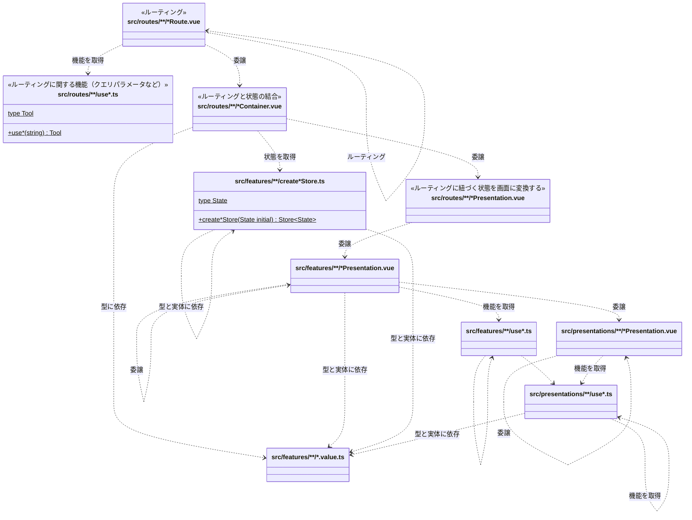

# accup.github.io

## コンポーネント図

```mermaid
classDiagram
  class `src/routes/**/*Route.vue` {
    <<ルーティング>>
  }
  `src/routes/**/*Route.vue` ..> `src/routes/**/*Route.vue` : ルーティング
  `src/routes/**/*Route.vue` ..> `src/routes/**/use*.ts` : 機能を取得
  `src/routes/**/*Route.vue` ..> `src/routes/**/*Container.vue` : 委譲
  class `src/routes/**/use*.ts` {
    <<ルーティングに関する機能（クエリパラメータなど）>>
    type Tool$
    +use*(string)$ Tool
  }
  class `src/routes/**/*Container.vue` {
    <<ルーティングと状態の結合>>
  }
  `src/routes/**/*Container.vue` ..> `src/routes/**/*Presentation.vue` : 委譲
  `src/routes/**/*Container.vue` ..> `src/features/**/create*Store.ts` : 状態を取得
  `src/routes/**/*Container.vue` ..> `src/features/**/*.value.ts` : 型に依存
  class `src/routes/**/*Presentation.vue` {
    <<ルーティングに紐づく状態を画面に変換する>>
  }
  `src/routes/**/*Presentation.vue` ..> `src/features/**/*Presentation.vue` : 委譲
  `src/features/**/*Presentation.vue` ..> `src/features/**/*Presentation.vue` : 委譲
  `src/features/**/*Presentation.vue` ..> `src/features/**/use*.ts` : 機能を取得
  `src/features/**/*Presentation.vue` ..> `src/features/**/*.value.ts` : 型と実体に依存
  `src/features/**/*Presentation.vue` ..> `src/presentations/**/*Presentation.vue` : 委譲
  `src/features/**/use*.ts` ..> `src/features/**/use*.ts`
  `src/features/**/use*.ts` ..> `src/presentations/**/use*.ts`
  class `src/features/**/create*Store.ts` {
    type State$
    +create*Store(State initial)$ Store~State~
  }
  `src/features/**/create*Store.ts` ..> `src/features/**/create*Store.ts` : 型と実体に依存
  `src/features/**/create*Store.ts` ..> `src/features/**/*.value.ts` : 型と実体に依存
  `src/presentations/**/*Presentation.vue` ..> `src/presentations/**/*Presentation.vue` : 委譲
  `src/presentations/**/*Presentation.vue` ..> `src/presentations/**/use*.ts` : 機能を取得
  `src/presentations/**/use*.ts` ..> `src/presentations/**/use*.ts` : 機能を取得
  `src/presentations/**/use*.ts` ..> `src/features/**/*.value.ts` : 型と実体に依存
```
