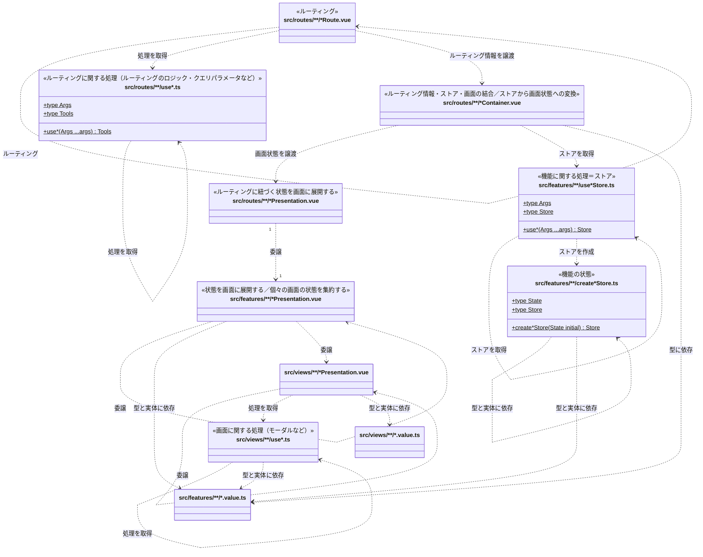

# accup.github.io

## コンポーネント図

```mermaid
classDiagram
  class `src/routes/**/*Route.vue` {
    <<ルーティング>>
  }
  `src/routes/**/*Route.vue` ..> `src/routes/**/*Route.vue` : ルーティング
  `src/routes/**/*Route.vue` ..> `src/routes/**/use*.ts` : 処理を取得
  `src/routes/**/*Route.vue` ..> `src/routes/**/*Container.vue` : ルーティング情報を譲渡
  class `src/routes/**/use*.ts` {
    <<ルーティングに関する処理（ルーティングのロジック・クエリパラメータなど）>>
    +type Args$
    +type Tools$
    +use*(Args ...args)$ Tools
  }
  `src/routes/**/use*.ts` ..> `src/routes/**/use*.ts` : 処理を取得
  class `src/routes/**/*Container.vue` {
    <<ルーティング情報・ストア・画面の結合／ストアから画面状態への変換>>
  }
  `src/routes/**/*Container.vue` ..> `src/routes/**/*Presentation.vue` : 画面状態を譲渡
  `src/routes/**/*Container.vue` ..> `src/features/**/use*Store.ts` : ストアを取得
  `src/routes/**/*Container.vue` ..> `src/features/**/*.value.ts` : 型に依存
  class `src/routes/**/*Presentation.vue` {
    <<ルーティングに紐づく状態を画面に展開する>>
  }
  `src/routes/**/*Presentation.vue` "1" ..> "1" `src/features/**/*Presentation.vue` : 委譲
  class `src/features/**/*Presentation.vue` {
    <<状態を画面に展開する／個々の画面の状態を集約する>>
  }
  `src/features/**/*Presentation.vue` ..> `src/features/**/*Presentation.vue` : 委譲
  `src/features/**/*Presentation.vue` ..> `src/features/**/*.value.ts` : 型と実体に依存
  `src/features/**/*Presentation.vue` ..> `src/views/**/*Presentation.vue` : 委譲
  class `src/features/**/use*Store.ts` {
    <<機能に関する処理＝ストア>>
    +type Args$
    +type Store$
    +use*(Args ...args)$ Store
  }
  `src/features/**/use*Store.ts` ..> `src/features/**/use*Store.ts` : ストアを取得
  `src/features/**/use*Store.ts` ..> `src/features/**/create*Store.ts` : ストアを作成
  class `src/features/**/create*Store.ts` {
    <<機能の状態>>
    +type State$
    +type Store$
    +create*Store(State initial)$ Store
  }
  `src/features/**/create*Store.ts` ..> `src/features/**/create*Store.ts` : 型と実体に依存
  `src/features/**/create*Store.ts` ..> `src/features/**/*.value.ts` : 型と実体に依存
  `src/views/**/*Presentation.vue` ..> `src/views/**/*Presentation.vue` : 委譲
  `src/views/**/*Presentation.vue` ..> `src/views/**/use*.ts` : 処理を取得
  `src/views/**/*Presentation.vue` ..> `src/views/**/*.value.ts` : 型と実体に依存
  class `src/views/**/use*.ts` {
    <<画面に関する処理（モーダルなど）>>
  }
  `src/views/**/use*.ts` ..> `src/views/**/use*.ts` : 処理を取得
  `src/views/**/use*.ts` ..> `src/features/**/*.value.ts` : 型と実体に依存
```
